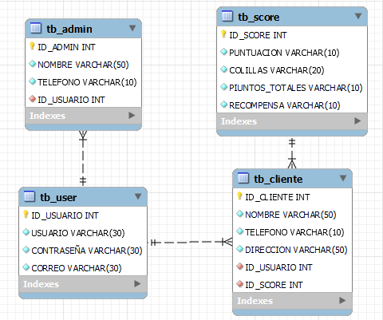

<h1>Documentación Backend</h1>

<h2>Indice</h2>

- [Instalación](#instalación)
  - [Instalar módulo node](#instalar-módulo-node)
  - [Instalar módulo mysql](#instalar-módulo-mysql)
  - [Instalar módulo nodemon](#instalar-módulo-nodemon)
- [Base de datos](#base-de-datos)
  - [Tablas](#tablas)
  - [Query](#query)
  - [Diagrama Entidad Relación](#diagrama-entidad-relación)
- [Despliegue](#despliegue)
  - [Despliegue de la base de datos con azure](#despliegue-de-la-base-de-datos-con-azure)
  - [Despliegue de la api node.js (express)](#despliegue-de-la-api-nodejs-express)

# Instalación
## Instalar módulo node

Primero que el archivo se ejecute necesitarás tener instalado node.js y ejecutar el siguiente comando dentro de la carpeta raíz del proyecto.

```
    npm install
```

## Instalar módulo mysql

Normalmente el comando anterior instalara todos los módulos incluyendo MySql pero para evitar problemas utiliza el siguiente comando para comprobar que se haya instalado correctamente.

```
    npm install mysql
```

## Instalar módulo nodemon

Este módulo no es necesario pero si quieres hacerle cambios al código podría serte muy útil para no tener que reiniciar la aplicación cada que hagas una modificación, para poderlo instalar podrías usar cualquiera de los siguientes comandos.

1. Instalación global (no recomendado)

 ```
    npm install -g nodemon
 ```

2. Instalación solo en el proyecto (recomendado)

```
    npm install --save-dev nodemon #También puedes utilizar npm i nodemon -D
```

3. Uso

```
    npm run dev
```

# Base de datos
## Tablas

Este es el query utilizado para la realización de este proyecto, el cual cuenta con cuatro tablas:

1. Usuario
2. Score
3. Cliente
4. Administrador

Usuario: En esta tabla solo se guardara la información de su usuario, correo y contraseña de nuestro cliente o administrador.

Score: Aquí nos encargamos directamente de guardar la información de los puntos que ha generado, los puntos totales aunque ya los haya intercambiado a modo de historial, el número de colillas que ha depositado y por ultimo se encuentra guardada la información de el número de recompensas que ha canjeado.

Clientes: Con esta tabla podemos llevar un registro de la información extra del cliente una vez después de que se haya registrado, entre los datos que guardamos están el nombre, teléfono, dirección, id de su usuario y id de su score.

Administrador: Esta tabla un poco más corta registra la información personal de nuestros administradores la cual sería su nombre, teléfono y su Id de usuario.

## Query

El query fue realizado en MySql

```
CREATE DATABASE IF NOT EXISTS WASTE2MONEYDB;

USE WASTE2MONEYDB;

CREATE TABLE TB_USER(
ID_USUARIO INT NOT NULL AUTO_INCREMENT PRIMARY KEY,
USUARIO NVARCHAR(30) NOT NULL,
CONTRASEÑA NVARCHAR(30) NOT NULL,
CORREO NVARCHAR(30) NOT NULL
);

CREATE TABLE TB_SCORE(
ID_SCORE INT NOT NULL AUTO_INCREMENT PRIMARY KEY,
PUNTUACION NVARCHAR(10) NOT NULL,
COLILLAS NVARCHAR(20) NOT NULL,
PUNTOS_TOTALES NVARCHAR(10) NOT NULL,
RECOMPENSA NVARCHAR(10) NOT NULL

);

CREATE TABLE TB_CLIENTE (
    ID_CLIENTE INT NOT NULL AUTO_INCREMENT PRIMARY KEY,
    NOMBRE NVARCHAR(50) NOT NULL,
    TELEFONO NVARCHAR(10) NOT NULL,
    DIRECCION NVARCHAR(50) NOT NULL,
    ID_USUARIO INT NOT NULL,
    ID_SCORE INT NOT NULL,
    CONSTRAINT fk_Cliente_User FOREIGN KEY (ID_USUARIO)
        REFERENCES TB_USER (ID_USUARIO),
    CONSTRAINT fk_Score FOREIGN KEY (ID_SCORE)
        REFERENCES TB_SCORE (ID_SCORE)
);

CREATE TABLE TB_ADMIN(
ID_ADMIN INT NOT NULL AUTO_INCREMENT PRIMARY KEY,
NOMBRE NVARCHAR(50) NOT NULL,
TELEFONO NVARCHAR(10) NOT NULL,
ID_USUARIO INT NOT NULL,

CONSTRAINT fk_Administrador_User FOREIGN KEY (ID_USUARIO) REFERENCES TB_USER(ID_USUARIO)
);
```
## Diagrama Entidad Relación

Decidimos realizar una base de datos relacional debido a el tipo de proyecto que estamos manejando, se nos hizo mas practico tener tablas que se relacionen entre si para poder llevar un conteo de la puntuación de nuestros usuarios, así mismo creando un administrador.



# Despliegue
## Despliegue de la base de datos con azure

Para poder utilizar la base de datos dentro de la nube utilizamos azure, lo cual nos pareció la manera mas optima de realizarlo, para mysql usamos la version 8.0 con un plan de 1G en azure, el link de la base de datos es el siguiente: [dazabiproyect.mysql.database.azure.com](dazabiproyect.mysql.database.azure.com)

## Despliegue de la api node.js (express)

Para poder conectar la base de datos con el front-end nos inclinamos por utilizar node.js con el framework express de esta manera poder manejar el proyecto como api y hacer las peticiones directamente a la base de datos en la nube, esta aplicación la subimos igualmente a la nube para poder hacer que las conexiones no dependieran del uso local, en este caso usamos el apartado App Service, el link a la api es el siguiente: [http://dazabi-api.azurewebsites.net/users](http://dazabi-api.azurewebsites.net/users)
