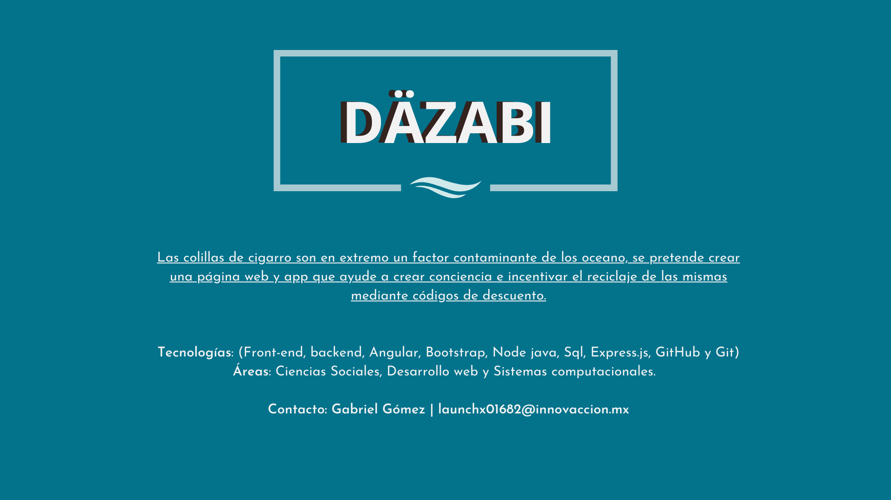

# DÄZABI 🌊🐚

## Descripción de repo 🚀✨

Este es el repositorio utilizado para el hackathon "HACK THE OCEAN". Contiene tanto el Front-end y back-end como las diversas implementaciones tecnologías ocupadas en las que se encuentran Angular, -, -, -, - , así como la instalación ocupada para entrelazar en el sitio final. Si tiene alguna sugerencia no dude en hacérnoslo saber, saludos cordiales. ¡Gracias!

## Visuales 👀

- [🎬 Video](https://www.youtube.com/watch?v=T_od3nS6WAU)
- [♪          Video de TikTok](./archivos/Publicidad)
- [👨🏻 Buyer Persona](./archivos/Buyer-Persona.pdf)
- [🎯 Pubico objetivo](./archivos/Pubico-objetivo.jpg)
- [📓 Wireframe UI](./archivos/Wireframe-UI)
- [☠️ Wireframe UX](./archivos/Wireframe-UX)
- [:bulb:  Publicidad](./archivos/Publicidad)

## Instalación ⚙️

Aqui va documentacion de Front y back 

## Autores 💪🏻
[Edgar Rodolfo Braquetes López](https://github.com/Braquetes)

[Luis Angel Barajas](https://github.com/BarajasAngel)

[Ingrid Berenice Bautista](https://github.com/IngridBandgel)

[Gabriel Gómez](https://github.com/gomez50057) (Representante)

[Juan Hernandez](https://github.com/grayTurtle01)

